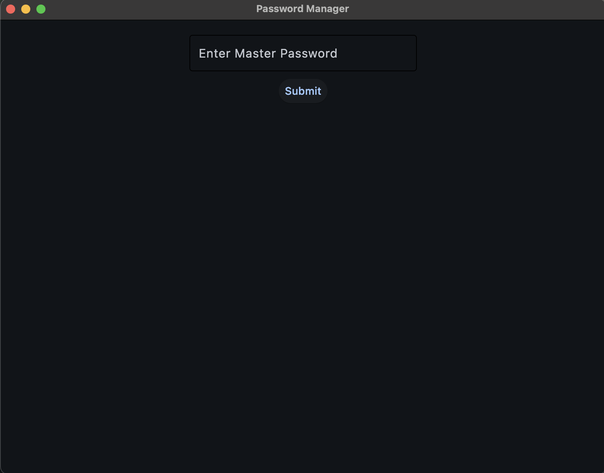
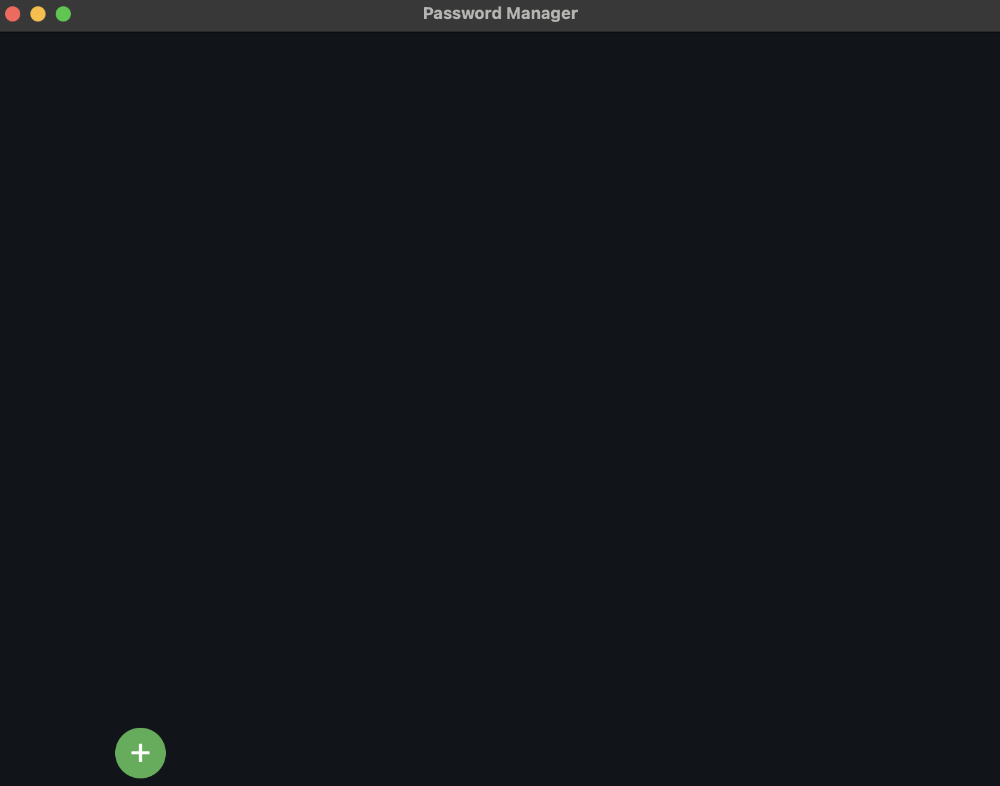
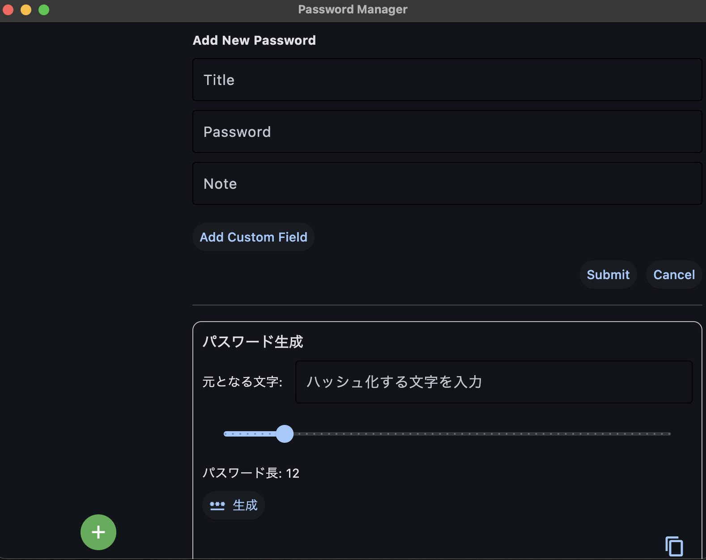
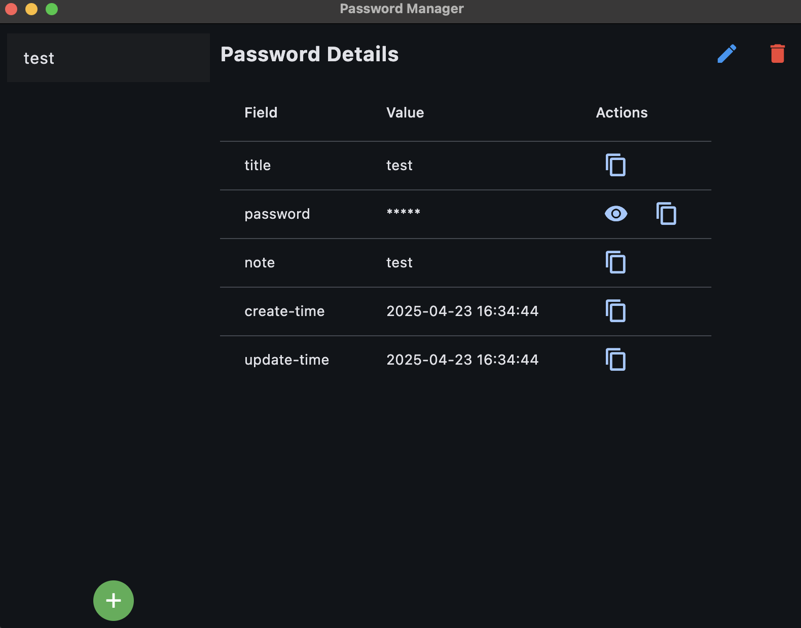

# パスワードマネージャー

シンプルで安全なパスワード管理ツール。

## 機能

- パスワードの安全な暗号化保存
- パスワードの追加、閲覧、更新、削除
- AES暗号化方式を使用したセキュアな保存

## TODO

- OTP対応

## セットアップ

1. リポジトリをクローン:

```bash
git clone https://github.com/sigma7641/passwordManager.git
cd passwordManager
```

2. 仮想環境を作成して有効化:

```bash
python -m venv venv
source venv/bin/activate  # Unix/macOS
# または
.\venv\Scripts\activate  # Windows
```

3. パッケージのインストール:

以下のいずれかの方法でインストールできます：

a) 開発モードでインストール:

```bash
pip install -e .
```

- ソースコードを編集しながら開発可能
- コードの変更がすぐに反映される

b) 通常モードでインストール:

```bash
pip install .
```

- コードの変更は反映されない

c) requirements.txtを使用してインストール:

```bash
pip install -r requirements.txt
```

- 依存パッケージのみをインストール

## 使い方

1. 仮想環境を有効化（まだ有効化していない場合）:

```bash
source venv/bin/activate  # Unix/macOS
# または
.\venv\Scripts\activate  # Windows
```

2. アプリケーションを起動:

```bash
python src/main.py
```

または、パッケージとしてインストールした場合:

```bash
python -m src.main
```

3. マスターパスワード入力

初回に入力したパスワードがAESのキーとなり、今後の復号時にも利用されます。



4. パスワード追加

`+`アイコンをクリックすることでパスワード情報を追加できます。



5. パスワード利用

サイドペインでtitleをクリックすると入力したパスワード情報を利用できます。



## セキュリティ

- AES暗号化を使用してパスワードを保護
- パスワードはローカルに暗号化された状態で保存

## ライセンス

このプロジェクトはMITライセンスの下で公開されています。詳細は[LICENSE](LICENSE)ファイルをご覧ください。
